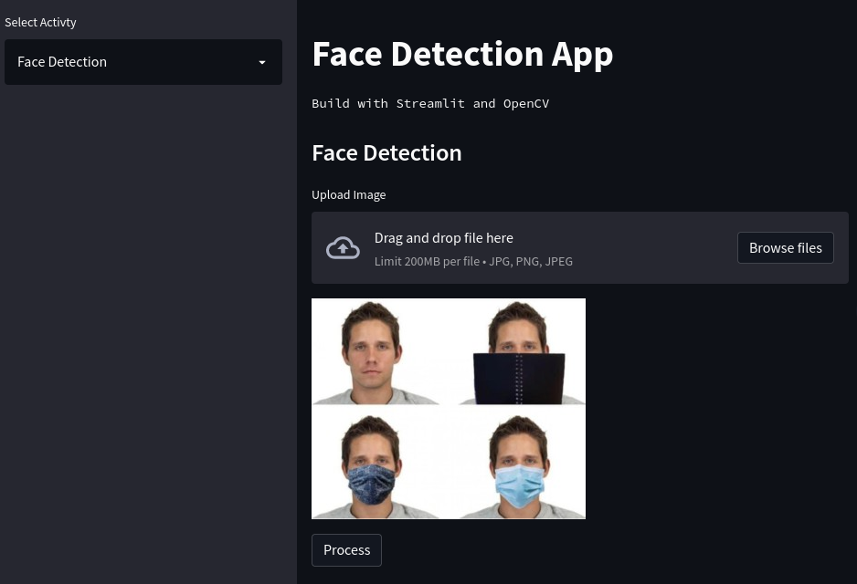
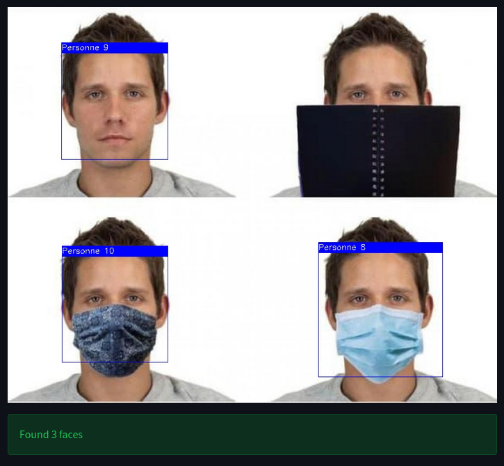
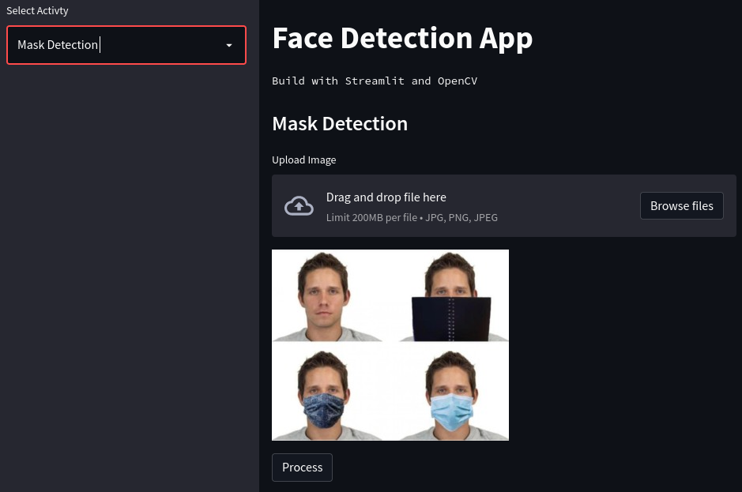
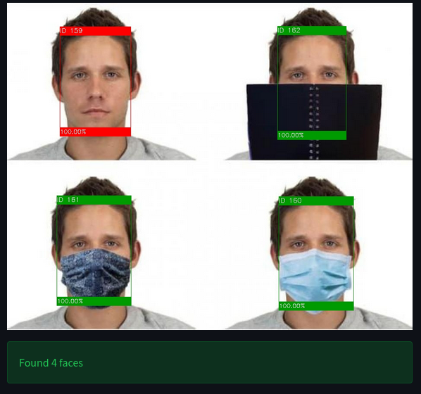
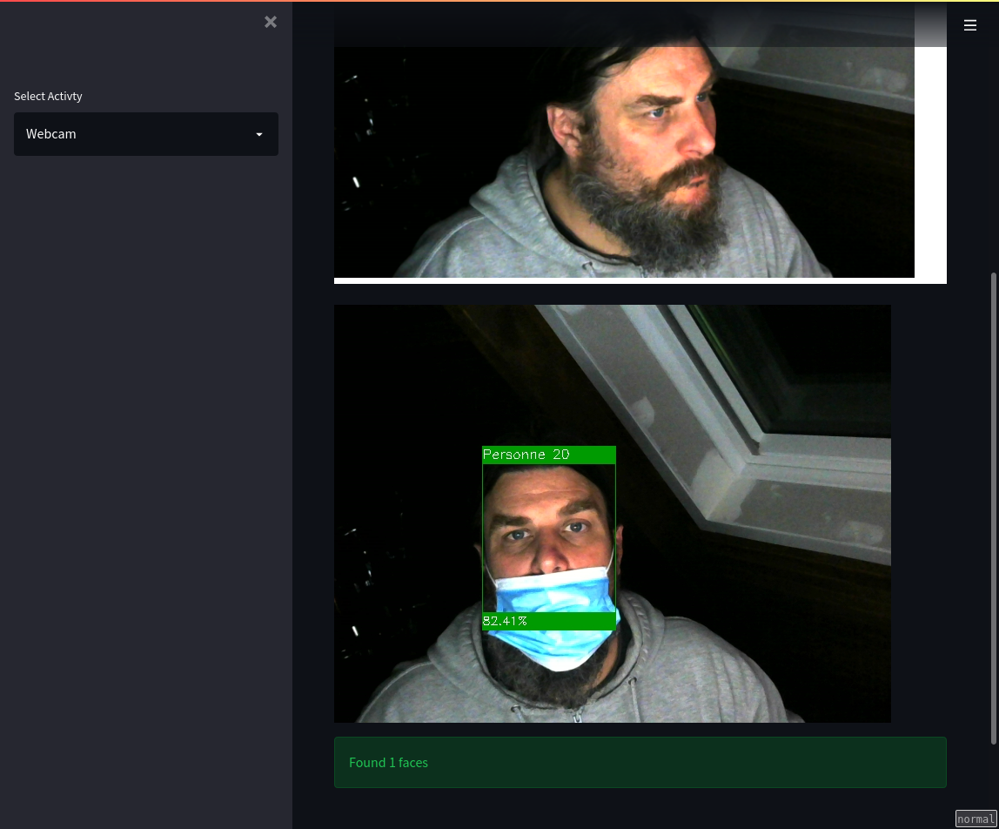
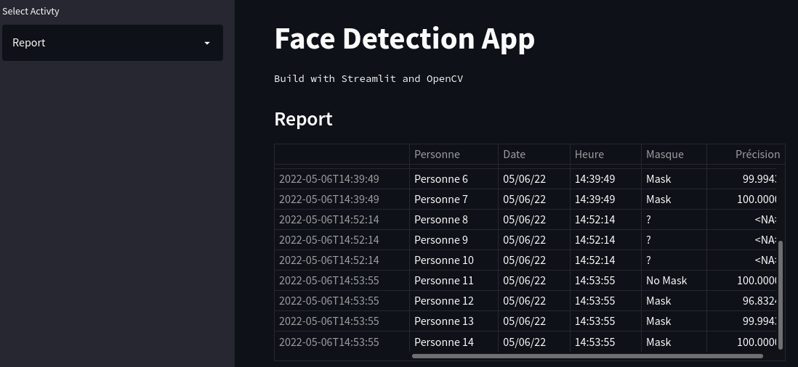

# Modèle intelligente pour la détection des masques (Avancé)

Transfer learning pour la détection des masques

## Contexte du projet

Nous cherchons à améliorer l’application qui a été développée lors de dernier Brief.

Il faudra développer une application Streamlit qui sera capable à détecter/localiser le ou les visages dans une image, et détecter par la suite la présence ou l’absence du masque pour chaque visage détecté.

Cahier de charge de l’application :
- [X] Charger une image.
- [X] Lancer la webcam (facultatif).
- [X] Détection du masque.
- [X] Comptage (personne avec masque et personne sans masque).
- [X] Un historique sous forme un tableau (personne, date/heure de détection et statut).

## Modalités pédagogiques

Le projet est réalisé en monome

## Critères de performance

Le bon fonctionnement de l'Application demandée.

## Livrables

Un dépôt GitHub avec :
- [X] L'application Streamlit avec les fichiers nécessaires.
- [X] Le modèle .h5
- [X] Un Readme.md pour mettre en avant votre projet

## Fonctionnement de l'application

L'application s'ouvre sur une page permettant la détection des visages.

### Detection des visages

Une image est fournie par défaut, et on peut en choisir une en local.

L'application a repéré 3 visages et les a ajouté à la liste des personnes identifiées.

### Détection des masques

L'onglet `Détection des masques` permet de trouver les visages masqués et non masqués :

L'application a marqué les personnes masquées en vert, et les non masquées en rouge, en indicant un indice de confiance dans la prédiction.

### webcam

L'image à analyser est prise par la webcam (à authoriser) :

### Historique

L'onglet `Report` permet de visualiser les personnes identifiées depuis le lancement de l'application.

## Todo

Il reste des axes d'améliorations et des fonctionnalités à implémenter :
- Séparer la fonction de détection des masques et celle de la detection des visages pour en utiliser qu'une, et les enchaîner
- Utiliser le flux vidéo pour faire une analyse en continue
